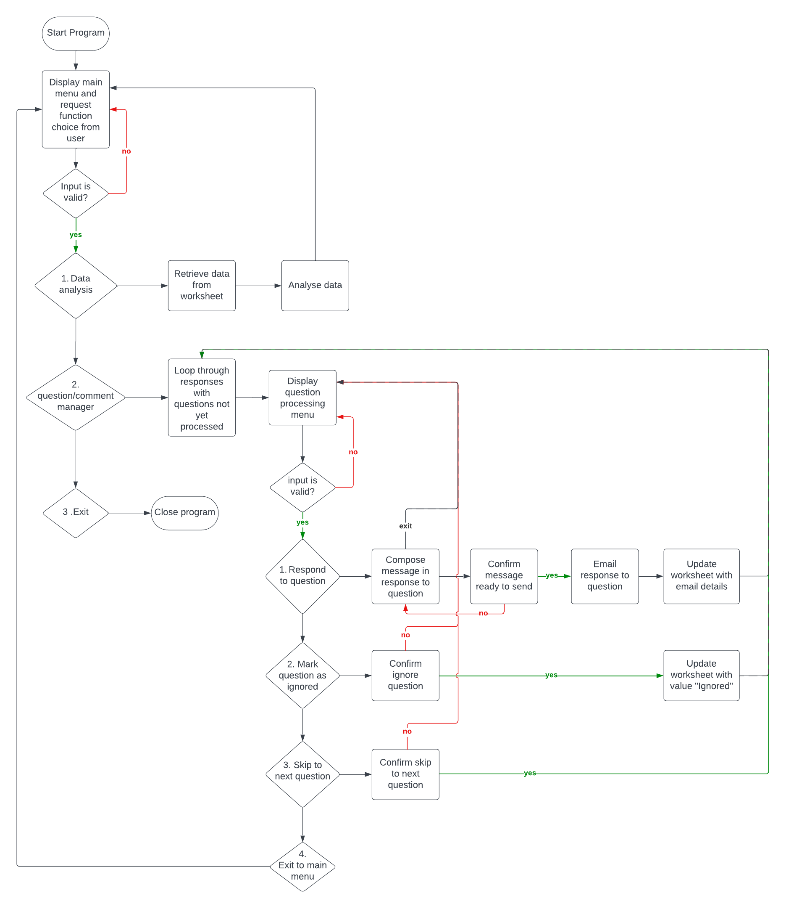
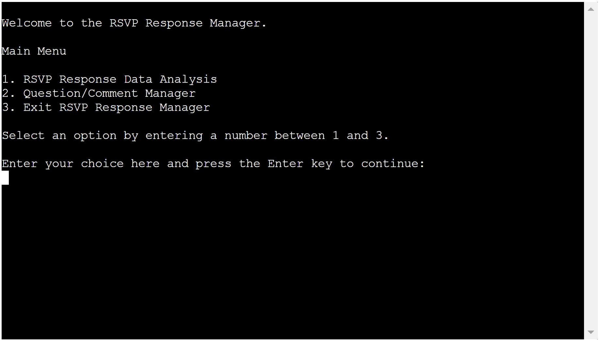
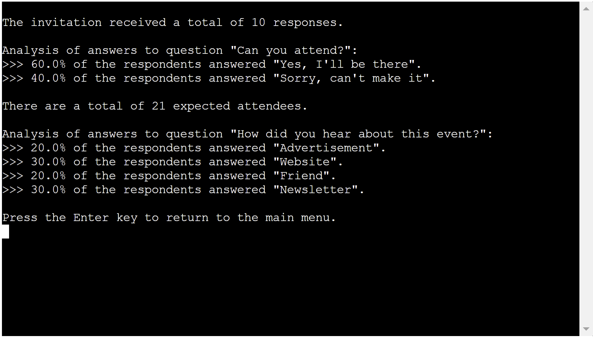
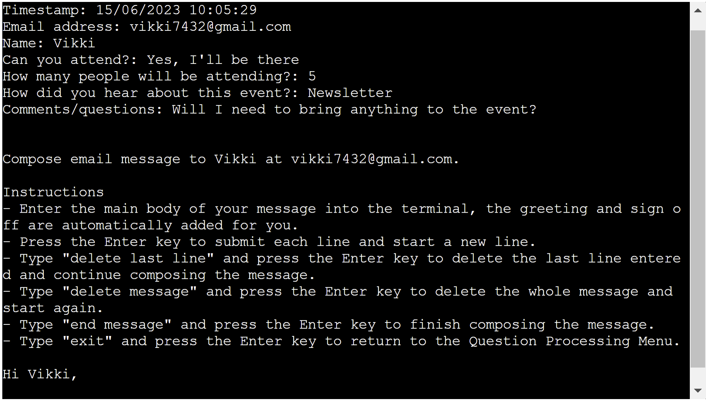
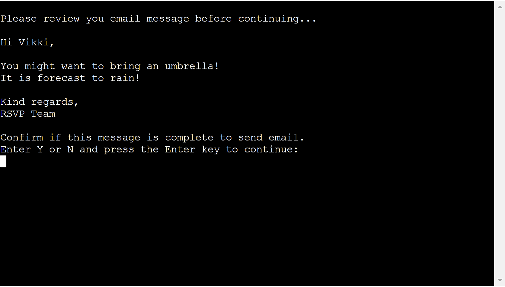
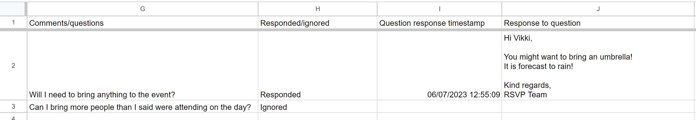

# RSVP Manager

The RSVP Response Manager is a command line application to view statistics relating to answers given by people who submitted an RSVP form, and process questions/comments received through this RSVP form. It is intended to be used by staff of organisations that hold public events.

The statistical analysis would be useful in answering question such as:
- How many people are expected to attend the event?
- How successful was the marketing of the event?
- What is the value of each employed marketing strategy?

The question/comment manager functionality is designed to provide means of responding to respondent's questions/comments via email. This feature provides a means of starting back and forth communication with individual respondents.

The RSVP response data is stored in an external Google Spreadsheet.

# User Experience (UX)
## User Stories

As a user I would like:
- To be able to view statistical analysis of the data collected.
- To be able to manage questions/comments received from respondents.
- To be able to respond to questions/comments received from respondents.
- To be able to update the worksheet storing the data with details about the actions taken to process the received questions/comments.

As a business owner I would like:
- To streamline the processes of analysing and processing data collected.
- To provide a means of quickly and efficiently determining the value of employed marketing strategies used by the business.
- To provide a way of communicating with respondents who have asked a question or left a comment on the RSVP response form.
- To have a record of actions taken by employees to process questions/comments.

# Design



# Features
## Current Features
### Main Menu
The program starts by welcoming the user and displaying the main menu. From here the user can choose to view the statistical analysis of the data stored in the RSVP Responses spreadsheet, process questions/comments received or exit the program. This feature is designed to help the user easily navigate through the program.



### RSVP Response Data Analysis
The RSVP Data Analysis feature calculates and displays the following:
- The total number of RSVP responses received.
- The percentage of "attending" and "not attending" answers received.
- The total number of expected attendees.
- The percentage of each answer for how the respondents heard about the event.
This analysis is designed to provide insights into the success of the businesses event planning and marketing strategies, and help find ways to improve these strategies.



### Question/Comment Manager
To process the questions/comments received, the user is asked to review the information displayed on the screen and choose an appropriate action for processing. The user can choose to respond to the question/comment, mark the question/comment as ignored, skip to the next question/comment or exit to the main menu. The program returns to the question/comment manager after a processing action has been completed and displays the next row of data in the RSVP response worksheet that contains a question/comment and does not contain the values "Responded" or "Ignored" in the "Responded/ignored" column, ready for processing. This feature is designed to help the user focus on individual responses and help make processing easy and efficient.


### Email Composer
If the user chooses to respond to the received question/comment they will be presented with the email composer feature. The RSVP data being processed is printed at the top of the screen for the user to refer to while writing their response. This feature is designed to allow the user to easily write a message in response to questions/comments received. The feature allows the user to enter multiple lines of text to complete their message, delete the last line entered, delete the whole message in order to start again and exit the email composer to return to the question/comment processing menu. The name and email address of the respondent is taken from the data and entered into the email for the user so the can simply write the body of the message and send. The sign off for the email is also added to the message by the program to save the user time. The instructions are printed on the screen to help the user use the feature.



The user is asked to review their and confirm the message is complete to send it to the respondent.



### Mark the question/comment as ignored
If the user chooses to mark the question/comment as ignored they will be asked to confirm that they wish to ignore the question/comment. If the user confirms they wish to mark the question as ignored the RSVP responses worksheet will be updated with the value "Ignored" in the "Responded/ignored" column and the program will return to the question/comment manager to process the next question/comment. If they choose not to ignore the question/comment the program will return to the question/comment processing menu to choose another action for processing the current question/comment. This feature helps to ensure questions/comments are not ignored by mistake.

### Skip to the next question/comment
If the user chooses to skip to the next question/comment they will be asked to confirm they wish to skip the question/comment. If the user confirms the wish to skip the question/comment the program will return to the question/comment manager to process the next question/comment. If they choose not to skip the question/comment the program will return to the question/comment processing menu to choose another action for processing the current question/comment. This feature helps to ensure questions/comments are not skipped by mistake.

### RSVP Responses Worksheet Updates
The RSVP Responses worksheet is updated after send an email in response to a question/comment or ignoring a question/comment as shown in the following image:



# Technologies Used
[Python 3.8](https://www.python.org/)

[Lucidchart](https://www.lucidchart.com/pages) - used to create the flowcharts outlining the functionality of the project.

[Google Forms](https://www.google.co.uk/forms/about/) - used to create an RSVP form, the data from which is stored in a Google Spreadsheet.

[Google Sheets](https://www.google.co.uk/sheets/about/) - used to store the data used in the program.

[Google Cloud Platform](https://cloud.google.com/) - to set up and manage Google APIs.

[Google Drive API](https://console.cloud.google.com/apis/library/drive.googleapis.com) - to generate credentials used to securely access the Google Spreadsheet.

[Google Sheets API](https://console.cloud.google.com/apis/library/sheets.googleapis.com) - to open, read and modify RSVP_Responses spreadsheet.

[SendGrid API](https://sendgrid.com/solutions/email-api/) - to send emails in response to question/comments received.

[Google Auth](https://google-auth.readthedocs.io/en/master/reference/google.oauth2.service_account.html) - To access the credentials class required to use the credentials generated by Google Drive API.

[gspread](https://docs.gspread.org/en/latest/) - required to access and update RSVP_Responses spreadsheet through Google Sheets API.

[sys](https://docs.python.org/3.8/library/sys.html) - to use the `exit()` method to close the program.

[itertools](https://docs.python.org/3.8/library/itertools.html) - to use the `islice()` method to remove dictionary items.

[sendgrid.helpers.mail](https://docs.sendgrid.com/for-developers/sending-email/quickstart-python#install-the-helper-library) - To define to/from email addresses, subject and message for sending emails using SendGrid.

[datetime](https://docs.python.org/3.8/library/datetime.html) - to access classes for manipulating dates and times.

[time](https://docs.python.org/3.8/library/time.html) - to use the `sleep()` method to pause the program.

[os](https://docs.python.org/3.8/library/os.html) - To get variables from environment.

[Python-dotenv](https://pypi.org/project/python-dotenv/) - To load `.env` file containing variables required to use SendGrid.

[Code Institute's Python Essentials Template](https://github.com/Code-Institute-Org/p3-template) - To provide front-end files to create a mock terminal in which to use this project.

[Git](https://git-scm.com/) - for version control.

[GitHub](https://github.com/) - to create and store the project repository.

[Heroku](https://www.heroku.com/) - to deploy the application.

# Testing
## Functionality Testing

[See Functionality Testing Document](docs/testing/functionality-testing.md)

## Bugs Encountered
### Fixed

1. During development I found that if I began question/comment processing and then returned to main menu to view the data analysis, the question/comment manager would continue its loop immediately after displaying the data analysis. This was fixed by adding an input asking the user to press the Enter key to return to the main menu and calling `main_menu()`.
2. When deployed to Heroku I found the send email functionality was not working. To enable this functionality on Heroku I added the SendGrid API key and email address to send emails from as config vars. To enable email functionality in development I replaced the `config.ini` file containing the SendGrid API key and email address to send emails from with a `.env` file containing these details. I also added a config var of `DEPLOYED = True` to Heroku and the following code:
    ```python
    if not os.environ.get("DEPLOYED"):
        from dotenv import load_dotenv
        load_dotenv('.env')
    ```

    This meant getting the variables using `os.environ[]` would work in both Heroku and the development environment.
3. The Y/N input loops in the ignore and skip functions would continue for as many times as the input N was given before a input of Y was given. This was fixed by adding `n_input = False` to the beginning of the loop, a break keyword to the `if input == 'y'`, a break keyword and `n_input = True` to the `if input == 'n'`, and adding the following code after the loop:
    ```python
    if n_input:
        question_processing_menu(row_data)
    ```

# 6. Local Development and Deployment

## Local Development
### Forking the Repository

- Log in to GitHub.
- Go to the repository for this project (https://github.com/VictoriaParkes/rsvp-manager).
- In the top-right corner of the page, click "Fork".
- Under "Owner", select an owner for the repository from the dropdown menu.
- Optionally, in the "Description" field, type a description of your fork.
- To copy the main branch only, select the "Copy the main branch only" check box. If you do not select this option, all branches will be copied into the new fork.
- Click "Create fork"

### Cloning Your Forked Repository

- Log-in to GitHub.com, navigate to your fork of the repository.
- Above the list of files, click Code.
- Copy the URL for the repository.
    - To clone the repository using HTTPS, under "Clone with HTTPS", click the "Copy" icon.
    - To clone the repository using an SSH key, including a certificate issued by your organization's SSH certificate authority, click SSH, then click the "Copy" icon.
    - To clone a repository using GitHub CLI, click Use GitHub CLI, then click the "Copy" icon.
- Open Git Bash
- Change the current working directory to the location where you want the cloned directory.
- Type git clone, and then paste the URL you copied earlier.
- Press Enter. Your local clone will be created.

For more details about forking and cloning a repository, please refer to [GitHub documentation](https://docs.github.com/en/get-started/quickstart/fork-a-repo).

## How to Create and Configure the Google Spreadsheet and APIs
### Create Google Spreadsheet

- Create and log into a Google account.
- Follow this link to the RSVP Responses Google Spreadsheet: [RSVP Responses Google Spreadsheet](https://docs.google.com/spreadsheets/d/1Hl8TFfDs7YxgQEwGxWAin5Mbpe8_pc0U-kdVxujAWus/edit?usp=sharing)
- Select file and make a copy of the spreadsheet and name it "RSVP_Responses".
- You now have a copy of the RSVP Responses spreadsheet that you can edit and use for this project.
- You can change the respondent email addresses to the email address of an account you have access to if you would like to view the emails sent in this project.

### Enable Google Sheets API
- Follow this link to the Google Cloud Platform: [Google Cloud Platform](https://console.cloud.google.com/)
- Click on the "Select a project" button then select "NEW PROJECT".
- Give your project a name.
- Click "Select Project" to go to your project page.
- Select "APIs and services" from the side menu, and then select “Library”.
- Search for and select Google Drive API.
- Enable Google Drive API, this will take you to the API overview page.
- To create your credentials click "CREATE CREDENTIALS".
- Fill out the form with the following details:

    - From the "Which API are you using?" dropdown menu, choose Google Drive API.
	- For the "What data will you be accessing?" question, select Application Data.
	- For the "Are you planning to use this API with Compute Engine, Kubernetes Engine, App Engine, or Cloud Functions?" question, select "No, I'm not using them".
	- Click Next.
	- Enter a Service Account name.
	- Click Create.
	- In the Role Dropdown box choose Basic > Editor.
	- Click Continue.
	- The Grant users access to this service account options can be left blank.
	- Click Done.
	- On the next page, click on the Service Account that has been created.
	- On the next page, click on the Keys tab.
	- Click on the Add Key dropdown and select Create New Key.
	- Select JSON and then click Create. This will trigger a `.json` file with your API credentials in it to download to your machine.

- Select Library from the side menu.
- Search for and select Google Sheets API.
- Enable Google Sheets API, no credentials need to be created.

### Set up SendGrid API
- Follow this link to the SendGrid website and create an account: [SendGrid](https://sendgrid.com/)
- In order to use SendGrid to send email you will need to complete the following steps:

	- Set up two-factor authentication:

		- From the side menu select "Two-Factor Authentication".
		- Click the "Add Two-Factor Authentication" button.
		- Choose your preferred authentication method, the Authy app or txt message.
		- Enter your country code and phone number.
		- If you chose to use the Authy app to authenticate you will need to access this app on your phone.
		- Enter the 7 digit code sent to your phone and click save.
		- Now when you login to SendGrid you will be asked to enter a 7 digit code that will be sent to your phone to authenticate your identity.

	- Complete sender authentication:

		- From the side menu select "Sender Authentication".
		- This step can be completed by clicking "Verify a Single Sender".
		- Enter the name you want to be shown to the recipient.
		- Enter the email address you want to send emails from.
		- Enter the email you want recipients to reply to.
		- You can enter n/a as the company address.
		- Enter your city.
		- Select your country from the drop down.
		- Enter a nickname for your reference.

	- Create an API key:

		- From the side menu select "API Keys"
		- Click the "Create an API Key" button.
		- Enter an API key name.
		- For this project you can select "Restricted Access" and choose full access for "Mail Send" only.
		- Your API key will be displayed on screen.
        - Make sure you copy the API key and save it somewhere safe as it will not be shown to you again after you leave the page.

### Setting Up Your Workspace
- Create a credentials file.

	- Locate the json file that was created when setting up Google Drive API.
	- Drag and drop this file into your workspace and rename it to `creds.json`.
	- Open the `creds.json` file and find the `client_email` value.
	- Copy the email address without the quotes around it and navigate to your Google Spreadsheet.
	- Click the "Share" button and paste in the client email, make sure “Editor” is selected, untick “Notify People”, and then click "share".
    
- Create a `.env` file

	- Create a new file in your workspace and name it `.env`.
	- Add the following on separate line:
	    - RSVP_EMAIL = the email address you want to send messages from
		- SENDGRID_APIKEY = the API key generated by SendGrid
	- Make sure that both the `creds.json` and `.env` files are listed in the `.gitignore` file to prevent them being sent to GitHub, this should already be the case.
	- Installing additional required packages:
		- Install gspread and google-auth libraries in the development environment using the command "pip3 install gspread google-auth".
		- Install SendGrid in the development environment using the command "pip3 install sendgrid".
		- Install python-dotenv in the development environment using the command "pip3 install python-dotenv".

- Commit your changes with an appropriate commit message and push to GitHub.

### Deploying the project to Heroku
- The requirements.txt file in the project was updated to include details on the project dependencies. Steps to do this are :
	- Enter the following command at the terminal prompt : "pip3 freeze > requirements.txt"
	- Commit changes to requirements.txt and push to GitHub.
- Log in to Heroku, create an account if necessary.
- From the Heroku dashboard, click "Create new app". For a new account a button will be displayed on screen, if you already have one or more apps created a link to this function is located in the "New" dropdown menu at the top right of the screen.
- On the Create New App page, enter a unique name for the application and select region. Then click Create app.
- Select the "settings" tab and click the "Reveal Config Vars" button.
- Enter the following values into the specified fields and click "Add":

	| KEY | VALUE |
    |-----|-------|
	| CREDS | paste the entire contents of the creds.json file into the VALUE field |
	| DEPLOYED | True |
	| PORT | 8000 |
	| RSVP_EMAIL | Enter the email address you want to send emails from |
	| SENDGRID_APIKEY | Enter the API key generated by SendGrid |

- Next, scroll down the Settings page to "Buildpacks". Click "Add buildpack", select Python from the pop up window and click on "Save changes". Click "Add buildpack" again, select Node.js from the pop up window and click on "Save changes". It is important that the buildpacks are listed Python first, then Node.js beneath.
- Select the "Deploy" tab.
- Select GitHub as the Deployment Method and click "Connect to GitHub".
- Enter the name of your GitHub repository in the search bar and click "Search".
- Click the "Connect" button to link your GitHub repository with your Heroku app.
- Scroll down the page and choose to either Automatically Deploy each time changes are pushed to GitHub, or Manually deploy.
- The application can be run from the Application Configuration page by clicking on the Open App button.

# 7. Credits
## Code
[W3 Schools](https://www.w3schools.com/) and lessons from [Code Institute's Full Stack Developer Course](https://codeinstitute.net/full-stack-software-development-diploma/) were frequently referred to in the development of this website.

- To valiadate numerical inputs code from [Code Institute's](https://codeinstitute.net/full-stack-software-development-diploma/) Love Sandwiches walkthrough project was used and modified.
- Making a list of dictionaries containing the row values of responses which contain a question/comment that had not yet been ignored or responded to was done using [Python | Removing dictionary from list of dictionaries](https://www.geeksforgeeks.org/python-removing-dictionary-from-list-of-dictionaries/) from GeeksforGeeks.
- `islice()` was utilised to remove unwanted dictionary items using [How to Slice a Dictionary in Python, With Examples](https://www.linuxscrew.com/python-dictionary-slice) from LinuxScrew.
- The functionality to send emails through SendGrid was achieved using the following sources:
    - [Send Mail Using Python (SendGrid)](https://youtu.be/1KgmOnxe5FM) from Easy Coder.
    - SendGrid's Python integration guide [How to send email using Python](https://app.sendgrid.com/guide/integrate/langs/python).
- The email functionality on Heroku bug was fixed using the following sources:
    - ["Avoid THIS Bad Practise In Python": An Introduction to .env Files](https://youtu.be/c42T5wKSztQ) from Indently.
    - [How to use dotenv package to load environment variables in Python](https://www.python-engineer.com/posts/dotenv-python/) by Pratik Choudhari on www.python-engineer.com.
    - [Environment Variables in Heroku - Python](https://dev.to/vulcanwm/environment-variables-in-heroku-python-385o) from dev.to.
- The `.join()` method was utilised to join message composer inputs into a string using [Python String join() Method](https://www.w3schools.com/python/ref_string_join.asp) from [W3 Schools](https://www.w3schools.com/).
- Moving the cursor up in the console was done using [How do I move the terminal cursor up](https://stackoverflow.com/questions/72667299/how-do-i-move-the-terminal-cursor-up) on stackoverflow.com.
- Converting date format to update worksheet after sending email was achieved using [How to Convert a String to Datetime in Python?](https://codesolid.com/how-to-convert-a-string-to-datetime-in-python/) from codesolid.com.
- The `clear()` function to clear the screen was taken from [Clear terminal in Python](https://stackoverflow.com/questions/2084508/clear-terminal-in-python) on stackoverflow.com.
- The `pause()` function to pause the program was taken from [Correct way to pause a Python program](https://stackoverflow.com/questions/11552320/correct-way-to-pause-a-python-program) on stackoverflow.com.
- The `update_cell()` method was utilised using [gspread Documentation](https://buildmedia.readthedocs.org/media/pdf/gspread/latest/gspread.pdf).
- The message composer input system was made using [Multiple lines user Input in Python](https://bobbyhadz.com/blog/python-input-multiple-lines) by Borislav Hadzhiev on bobbyhadz.com.
- To break out of nested loops the following resource was used [5 Ways To Break Out of Nested Loops in Python](https://medium.com/techtofreedom/5-ways-to-break-out-of-nested-loops-in-python-4c505d34ace7) by Yang Zhou on medium.com.
- The `sys.exit()` method was utilised using [Python documentation](https://docs.python.org/3.8/library/sys.html#sys.exit).
- `if __name__ == '__main__':` was utilised using [What does the if __name__ == “__main__”: do?](https://www.geeksforgeeks.org/what-does-the-if-__name__-__main__-do/) and help from my mentor Brian Macharia.
- The try-except code to raise an error if the RSVP worksheet cannot be loaded was written using [How to check whether a file exists in Python](https://youtu.be/V6IX3k8PDBc) from mCoding and help from my mentor Brian Macharia.

## Acknowledgements
I would like to thank Brian Macharia, my Code Institute mentor, for his helpful feedback and advice.
