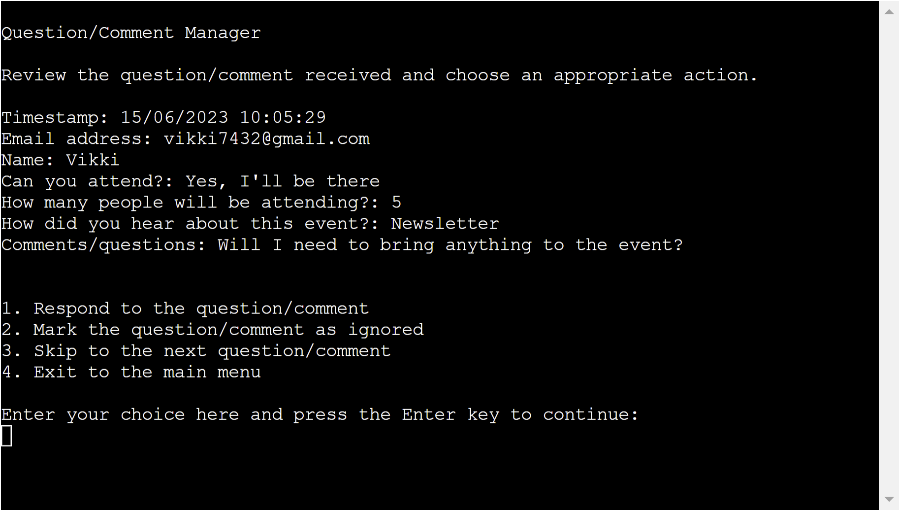

# RSVP Manager

The RSVP Response Manager is a command line application to view statistics relating to answers given by people who submitted an RSVP form, and process questions/comments received through this RSVP form. It is intended to be used by staff of organisations that hold public events.

The statistical analysis would be useful in answering question such as:
- How many people are expected to attend the event?
- How successful was the marketing of the event?
- What is the value of each employed marketing strategy?

The question/comment manager functionality is designed to provide means of responding to respondent's questions/comments via email. This feature provides a means of starting back and forth communication with individual respondents.

The RSVP response data is stored in an external Google Spreadsheet.

# User Experience (UX)
## User Stories

As a user I would like:
- To be able to view statistical analysis of the data collected.
- To be able to manage questions/comments received from respondents.
- To be able to respond to questions/comments received from respondents.
- To be able to update the worksheet storing the data with details about the actions taken to process the received questions/comments.

As a business owner I would like:
- To streamline the processes of analysing and processing data collected.
- To provide a means of quickly and efficiently determining the value of employed marketing strategies used by the business.
- To provide a way of communicating with respondents who have asked a question or left a comment on the RSVP response form.
- To have a record of actions taken by employees to process questions/comments.

# Design

# Features
## Current Features
### Main Menu
The program starts by welcoming the user and displaying the main menu. From here the user can choose to view the statistical analysis of the data stored in the RSVP Responses spreadsheet, process questions/comments received or exit the program. This feature is designed to help the user easily navigate through the program.

### RSVP Response Data Analysis
The RSVP Data Analysis feature calculates and displays the following:
- The total number of RSVP responses received.
- The percentage of "attending" and "not attending" answers received.
- The total number of expected attendees.
- The percentage of each answer for how the respondents heard about the event.
This analysis is designed to provide insights into the success of the businesses event planning and marketing strategies, and help find ways to improve these strategies.

### Question/Comment Manager
To process the questions/comments received, the user is asked to review the information displayed on the screen and choose an appropriate action for processing. The user can choose to respond to the question/comment, mark the question/comment as ignored, skip to the next question/comment or exit to the main menu. The program returns to the question/comment manager after a processing action has been completed and displays the next row of data in the RSVP response worksheet that contains a question/comment and does not contain the values "Responded" or "Ignored" in the "Responded/ignored" column, ready for processing. This feature is designed to help the user focus on individual responses and help make processing easy and efficient.

### Email Composer
If the user chooses to respond to the received question/comment they will be presented with the email composer feature. The RSVP data being processed is printed at the top of the screen for the user to refer to while writing their response. This feature is designed to allow the user to easily write a message in response to questions/comments received. The feature allows the user to enter multiple lines of text to complete their message, delete the last line entered, delete the whole message in order to start again and exit the email composer to return to the question/comment processing menu. The name and email address of the respondent is taken from the data and entered into the email for the user so the can simply write the body of the message and send. The sign off for the email is also added to the message by the program to save the user time. The instructions are printed on the screen to help the user use the feature.

The user is asked to review their and confirm the message is complete to send it to the respondent.

### Mark the question/comment as ignored
If the user chooses to mark the question/comment as ignored they will be asked to confirm that they wish to ignore the question/comment. If the user confirms they wish to mark the question as ignored the RSVP responses worksheet will be updated with the value "Ignored" in the "Responded/ignored" column and the program will return to the question/comment manager to process the next question/comment. If they choose not to ignore the question/comment the program will return to the question/comment processing menu to choose another action for processing the current question/comment. This feature helps to ensure questions/comments are not ignored by mistake.

### Skip to the next question/comment
If the user chooses to skip to the next question/comment they will be asked to confirm they wish to skip the question/comment. If the user confirms the wish to skip the question/comment the program will return to the question/comment manager to process the next question/comment. If they choose not to skip the question/comment the program will return to the question/comment processing menu to choose another action for processing the current question/comment. This feature helps to ensure questions/comments are not skipped by mistake.

### RSVP Responses Worksheet Updates
The RSVP Responses worksheet is updated after send an email in response to a question/comment or ignoring a question/comment as shown in the following image:

